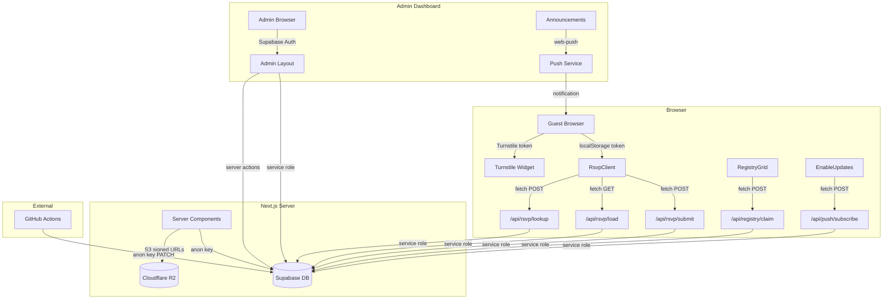

# Wedding Site — ChatGPT Project Handoff

> **Generated:** July 20, 2026 by Antigravity (Google Deepmind).
> **Branch:** `feature/sangeet-wedding-variant` @ commit `0a97e1b` (rename: /festivities → /invite).
> **Working tree:** Clean — no uncommitted changes.
> **Repository:** `https://github.com/anuragpin-edu/wedding-site`
> **Build status:** ✅ Production build passed. ESLint: 13 errors, 5 warnings (non-blocking — see §17).

---

## 1. Executive Summary

**What it is:** A custom wedding website for **Anurag & Thanmai**, getting married **August 22, 2026** in Cumming, Georgia (USA). Expected ~200 guests.

**Who it's for:** Wedding guests — to view event details, RSVP, browse/claim a gift registry, read updates, and optionally receive push notifications. Plus a private admin dashboard for the couple.

**Live domain:** `https://www.bunnymetanu.com` (Vercel-hosted, Cloudflare DNS).

**Current development phase:** Feature-complete for core flows. Active branch adds URL-based "site variants" (e.g., `/invite`, `/wedding`, `/celebrate`) that filter events per audience. Media (photos/videos) is loaded from Cloudflare R2. Cloudflare Turnstile spam protection is built but dormant (no keys configured yet).

**What currently works:**
- Full RSVP self-registration flow (create, edit, cross-device lookup)
- Gift registry with claim/hold/purchase workflow
- 3-event display with Add-to-Calendar (Haldi, Sangeeth, Wedding)
- Hero slideshow with R2-hosted media
- Admin dashboard (RSVP view + CSV export, registry management, announcements, push notifications, profile)
- Web Push notifications (VAPID-based)
- PWA (installable, service worker)
- URL-based site variants with event filtering
- Keep-alive GitHub Actions cron
- Security: RLS, rate limiting, security headers

**What remains incomplete:**
- Cloudflare Turnstile not activated (keys not set)
- Extra content sections (Our Story, Travel & Stay, FAQ) not built
- Real-device iOS push verification recommended
- ESLint errors in admin forms and test file

**Most important immediate next step:** Activate Cloudflare Turnstile by adding site/secret keys to protect RSVP and registry forms from spam before the site goes live to guests.

---

## 2. Product and Experience Overview

### Guest Journey (from arrival to completion)

1. **Landing / Hero:** Guest arrives at `bunnymetanu.com` (or a variant like `/invite`, `/wedding`). They see the couple's names ("Anurag & Thanmai"), wedding date, a live countdown timer, and a media slideshow of photos/videos from Cloudflare R2. CTA buttons: "RSVP" and "View Events."

2. **Gallery Section:** Below the hero, "Our Gallery" shows the same media in a fullscreen slideshow with crossfade transitions.

3. **The Celebrations:** Event cards (filtered per variant) showing date, time, venue, address, dress code, map directions, and Add-to-Calendar (Google Calendar / .ics download).

4. **Events Page (`/events`):** Full detail cards for each event (only shown when variant has >1 event). Includes `AddToCalendar`, `MapChooser` (platform-aware: Apple Maps on iOS, Google Maps otherwise), and dress code.

5. **RSVP (`/rsvp`):**
   - Self-registration: enter name, email, phone → add family members → select per-event attendance → dietary notes → submit.
   - Return visit: auto-loads via localStorage token, or use "Find my RSVP" cross-device lookup by email/phone.
   - Turnstile spam check (dormant until keys are set).
   - No pre-loaded guest list by design.

6. **Gift Registry (`/registry`):**
   - Items link to external stores (Amazon, IKEA, etc.)
   - Claim flow: "Planning to buy" (6-hour soft hold) or "Already bought" (permanent, requires order ID)
   - Contact info (name, email, phone) collected per claim, stored server-side, never shown publicly
   - Registry can be hidden via `REGISTRY_ENABLED=false` env var (currently shows "Coming Soon" when disabled)
   - Gift cards displayed separately without claim flow

7. **Updates (`/updates`):** Published announcements from admin. "Enable Updates" button for web push opt-in (with iOS Add-to-Home-Screen detection).

8. **Navigation:** Sticky header with "A & T" brand, hamburger menu on mobile. Links adapt per variant (Events link hidden when only 1 event).

9. **Footer:** Couple's names, date, contact emails (Anurag, Thanmai), and tagline.

### Site Variants (URL-based audience segmentation)

The middleware (`src/proxy.ts`) rewrites root URLs to variant-specific routes:

| Variant    | URL Path     | Events Shown          | Registry | Use Case                    |
|------------|--------------|----------------------|----------|-----------------------------|
| `default`  | `/`          | All 3 (Haldi, Sangeeth, Wedding) | Yes      | Full site for all guests   |
| `wedding`  | `/wedding`   | Wedding only          | Yes      | Wedding-only invitees      |
| `celebrate`| `/celebrate` | All 3                 | No       | No registry visible        |
| `invite`   | `/invite`    | Sangeeth + Wedding    | Yes      | Excludes Haldi             |

### Features NOT present in the codebase:
- Our Story / timeline section
- Travel & Stay (hotels, airports, parking)
- FAQ section
- Dress-code color swatches
- Background music
- Schedule timeline view

These are mentioned as "optional" or "lower priority" in `CLAUDE.md` but have no code.

---

## 3. Technology Stack

| Area | Technology | Version | Purpose | Evidence |
|------|-----------|---------|---------|----------|
| Frontend framework | Next.js (App Router) | 16.2.9 | SSR, routing, API routes, server actions | `package.json` line 17 |
| Language | TypeScript | ^5 | Type safety | `package.json` line 34, `tsconfig.json` |
| UI library | React | 19.2.4 | Component rendering | `package.json` lines 18–19 |
| Styling | Tailwind CSS v4 | ^4 | Utility-first CSS | `package.json` lines 23, 32; `globals.css` uses `@import "tailwindcss"` and `@theme inline` (v4 syntax, no `tailwind.config.js`) |
| PostCSS | @tailwindcss/postcss | ^4 | Tailwind processing | `postcss.config.mjs` |
| Database + Auth | Supabase | supabase-js ^2.108.1, ssr ^0.12.0 | Postgres, RLS, admin auth | `package.json` lines 15–16 |
| File storage | Cloudflare R2 | @aws-sdk/client-s3 ^3.1075.0, s3-request-presigner ^3.1077.0 | Photo/video hosting with signed URLs | `package.json` lines 12–13 |
| Video | Cloudflare Stream | @cloudflare/stream-react ^1.9.3 | Video playback | `package.json` line 14 |
| Push notifications | web-push (VAPID) | ^3.6.7 | Server-side push sending | `package.json` line 20 |
| Spam protection | Cloudflare Turnstile | N/A (client script loaded dynamically) | Bot/spam protection | `src/lib/turnstile.ts`, `src/components/Turnstile.tsx` |
| Image optimization | sharp | ^0.35.2 | Dev image processing | `package.json` line 31 |
| Hosting | Vercel | N/A | Deployment, preview deploys | `next.config.ts`, README |
| Keep-alive | GitHub Actions | N/A | Daily Supabase ping | `.github/workflows/keep-alive.yml` |
| Package manager | npm | 11.8.0 (local) | Dependency management | `package-lock.json` present |
| Node.js | Node.js | 25.6.0 (local) | Runtime | Verified via `node -v` |
| Fonts | Google Fonts (next/font) | N/A | Geist Sans, Cormorant Garamond | `src/app/layout.tsx` lines 7–17 |
| Linting | ESLint + eslint-config-next | ^9 / 16.2.9 | Code quality | `eslint.config.mjs`, `package.json` |
| Testing | None | — | No test framework configured | No test files, no test script in `package.json` |

---

## 4. Repository Map

```
wedding-site/
├── .env.example              # Environment variable template (34 lines)
├── .env.local                # Local secrets (gitignored)
├── .github/
│   └── workflows/
│       └── keep-alive.yml    # Daily Supabase ping via anon key
├── .gitignore                # Standard Next.js + env files + seed scripts
├── AGENTS.md                 # Agent instructions (points to next docs)
├── CLAUDE.md                 # Primary project context doc (130 lines) — AUTHORITATIVE
├── PROJECT_HANDOFF.md        # Earlier handoff (386 lines, branch `post-merge-polish`) — OUTDATED
├── README.md                 # Default create-next-app README — NOT CUSTOMIZED
├── eslint.config.mjs         # Flat ESLint config (next/core-web-vitals + typescript)
├── next.config.ts            # Security headers + custom R2 image loader
├── package.json              # Dependencies and scripts
├── postcss.config.mjs        # Tailwind PostCSS plugin
├── tsconfig.json             # Strict TS, bundler resolution, @/* path alias
├── 1                         # Stray redirect output file (31KB) — JUNK, in .gitignore
├── test-reg.js               # One-off registry test script (CommonJS) — TEMPORARY
├── scripts/
│   ├── generate-icons.mjs    # PWA icon generator from source PNG
│   └── optimize-media.ts     # Media optimization helper for R2 uploads
├── supabase/
│   ├── schema.sql            # PRIMARY schema: tables, seed data, RLS policies (238 lines)
│   ├── registry_v2.sql       # Migration: adds held_until, claim status refinement
│   ├── registry_v3.sql       # Migration: adds category column to registry_items
│   ├── add_registry_category.sql  # Adds category CHECK constraint
│   ├── rsvp_self_registration.sql # Migration: self-registration model changes
│   ├── settings.sql          # Creates settings table
│   └── keep_alive.sql        # Creates keep_alive table + RLS policies
├── public/
│   ├── icons/                # PWA icons (192, 512, maskable, apple-touch)
│   ├── sw.js                 # Service worker (push handling, notification clicks)
│   └── *.svg                 # Default Next.js SVGs (file, globe, next, vercel, window)
└── src/
    ├── proxy.ts              # Middleware: URL-based variant rewriting + Supabase session
    ├── types/
    │   └── database.ts       # TypeScript types mirroring DB schema (89 lines)
    ├── lib/
    │   ├── supabase/
    │   │   ├── client.ts     # Browser Supabase client (anon key)
    │   │   ├── server.ts     # Server Supabase client (anon key) + admin client (service role)
    │   │   ├── service.ts    # Service-role-only client (bypasses RLS)
    │   │   └── middleware.ts # Session refresh + /admin auth guard
    │   ├── admin.ts          # Admin email allowlist + getAdminUser()
    │   ├── adminData.ts      # Admin data queries (RSVPs, registry with claims)
    │   ├── calendar.ts       # Google Calendar URL + .ics generation
    │   ├── eventFormat.ts    # Client-safe date/time/maps formatting helpers
    │   ├── features.ts       # Feature flags (registryEnabled)
    │   ├── getEvents.ts      # Fetch events from Supabase (public read)
    │   ├── getMedia.ts       # R2 media listing + signed URL generation
    │   ├── push.ts           # Server-side web push (sendPushToAll)
    │   ├── pushClient.ts     # Browser push helpers (isIOS, isStandalone, etc.)
    │   ├── r2Loader.ts       # Custom Next.js Image loader for R2 URLs
    │   ├── rateLimit.ts      # In-memory per-IP rate limiter
    │   ├── registry.ts       # Registry logic (hold reconciliation, getRegistryItems)
    │   ├── rsvp.ts           # RSVP logic (party assembly, token/contact lookup)
    │   ├── settings.ts       # Key-value settings from DB
    │   ├── turnstile.ts      # Cloudflare Turnstile server verification
    │   └── variants.ts       # Site variant config and event filtering
    ├── components/
    │   ├── AddToCalendar.tsx  # Google/Apple calendar links per event
    │   ├── BunnyMark.tsx      # Decorative bunny SVG mark
    │   ├── ComingSoon.tsx     # Placeholder for disabled features
    │   ├── CopyButton.tsx     # Clipboard copy with confirmation
    │   ├── Countdown.tsx      # Live countdown to Aug 22, 2026 11:00 AM EDT
    │   ├── EnableUpdates.tsx  # Web push opt-in (iOS/Android/desktop aware)
    │   ├── EventArt.tsx       # Per-event decorative SVG artwork
    │   ├── EventCard.tsx      # Full event detail card
    │   ├── Footer.tsx         # Site footer with contact emails
    │   ├── HeroSlideshow.tsx  # Crossfading media slideshow
    │   ├── MapChooser.tsx     # Platform-aware map link (Apple Maps / Google Maps)
    │   ├── MediaDisplay.tsx   # Image/video renderer for slideshow
    │   ├── Nav.tsx            # Server component: sticky nav header
    │   ├── NavMenu.tsx        # Client component: responsive hamburger menu
    │   ├── RegistryGrid.tsx   # Gift registry with claim forms (378 lines)
    │   ├── RsvpClient.tsx     # Full RSVP form (403 lines) — largest component
    │   ├── ServiceWorkerRegister.tsx # Service worker registration
    │   ├── StreamVideo.tsx    # Cloudflare Stream video player wrapper
    │   ├── TraditionAccent.tsx # Decorative Pelli Pathrika SVG
    │   ├── Turnstile.tsx      # Cloudflare Turnstile widget wrapper
    │   ├── icons.tsx          # 11 inline SVG icon components
    │   └── admin/
    │       ├── ForgotForm.tsx # Password reset request form
    │       ├── LoginForm.tsx  # Admin login form
    │       ├── ProfileForm.tsx # Admin profile editor
    │       ├── ResetForm.tsx  # Password reset form
    │       └── ShippingAddressEditor.tsx # Editable shipping address
    └── app/
        ├── layout.tsx         # Root layout (fonts, metadata, ServiceWorker)
        ├── globals.css        # Theme tokens, Tailwind config, animations (120 lines)
        ├── manifest.ts        # PWA manifest generator
        ├── robots.ts          # robots.txt (allow all)
        ├── icon.png / apple-icon.png / opengraph-image.png / twitter-image.png
        ├── (public)/
        │   ├── layout.tsx     # Public layout (themed-pattern bg, Footer)
        │   └── [variant]/
        │       ├── layout.tsx # Variant layout (Nav, noindex robots)
        │       ├── page.tsx   # Homepage (hero, gallery, celebrations)
        │       ├── events/page.tsx    # Events listing
        │       ├── rsvp/page.tsx      # RSVP page wrapper
        │       ├── registry/page.tsx  # Gift registry page
        │       └── updates/page.tsx   # Announcements + push opt-in
        ├── admin/
        │   ├── login/page.tsx         # Login page
        │   ├── forgot/page.tsx        # Forgot password page
        │   ├── reset/page.tsx         # Password reset page
        │   └── (dashboard)/
        │       ├── layout.tsx         # Authenticated admin layout
        │       ├── page.tsx           # Overview (stats)
        │       ├── rsvps/page.tsx     # RSVP list
        │       ├── rsvps/export/route.ts # CSV export
        │       ├── registry/page.tsx  # Registry management
        │       ├── registry/[id]/page.tsx # Edit single item
        │       ├── registry/actions.ts # Server actions (CRUD)
        │       ├── announcements/page.tsx # Announcement management
        │       ├── announcements/actions.ts # Server actions (create, publish, push, delete)
        │       └── profile/page.tsx   # Admin profile
        └── api/
            ├── rsvp/
            │   ├── submit/route.ts    # Create/update RSVP (POST)
            │   ├── load/route.ts      # Load party by token (GET)
            │   └── lookup/route.ts    # Find party by email/phone (POST)
            ├── registry/
            │   └── claim/route.ts     # Claim registry item (POST)
            └── push/
                ├── subscribe/route.ts # Subscribe to push (POST)
                └── unsubscribe/route.ts # Unsubscribe (POST)
```

### Notes on specific files:
- `1` (root): Stray redirect output file, listed in `.gitignore`, should be deleted
- `test-reg.js` (root): One-off CommonJS test script for registry, causes ESLint errors, should be removed or converted
- `PROJECT_HANDOFF.md` (root): Earlier handoff from branch `post-merge-polish` — partially outdated (predates variant system, media security features)
- `README.md` (root): Default create-next-app boilerplate — not customized for this project

---

## 5. Routes and Page Inventory

### Public Routes (via `(public)/[variant]/`)

| Route Pattern | File | Purpose | Status | Main Components | Notes |
|---------------|------|---------|--------|-----------------|-------|
| `/` (or `/wedding`, `/invite`, `/celebrate`) | `[variant]/page.tsx` | Homepage: hero, gallery, celebrations | **Functional** | `Countdown`, `HeroSlideshow`, `EventCard`, `TraditionAccent` | `force-dynamic`; variant filtering active |
| `/events` | `[variant]/events/page.tsx` | Event detail cards | **Functional** | `EventCard` (×N) | Returns 404 if variant has ≤1 event |
| `/rsvp` | `[variant]/rsvp/page.tsx` | RSVP form | **Functional** | `RsvpClient` | Events filtered per variant |
| `/registry` | `[variant]/registry/page.tsx` | Gift registry | **Functional** | `RegistryGrid`, `ComingSoon`, `CopyButton` | 404 if `showRegistry=false`; "Coming Soon" if `REGISTRY_ENABLED=false` |
| `/updates` | `[variant]/updates/page.tsx` | Announcements + push opt-in | **Functional** | `EnableUpdates` | Loads published announcements |

### Admin Routes

| Route | File | Purpose | Status | Notes |
|-------|------|---------|--------|-------|
| `/admin/login` | `admin/login/page.tsx` | Login form | **Functional** | Static page |
| `/admin/forgot` | `admin/forgot/page.tsx` | Password reset request | **Functional** | Static page |
| `/admin/reset` | `admin/reset/page.tsx` | Password reset form | **Functional** | Static page |
| `/admin` | `admin/(dashboard)/page.tsx` | Overview dashboard | **Functional** | Shows stats: parties, guests, attendance, registry status |
| `/admin/rsvps` | `admin/(dashboard)/rsvps/page.tsx` | RSVP list | **Functional** | Per-party, per-guest, per-event attendance |
| `/admin/rsvps/export` | `admin/(dashboard)/rsvps/export/route.ts` | CSV export | **Functional** | Downloads all RSVP data as CSV |
| `/admin/registry` | `admin/(dashboard)/registry/page.tsx` | Registry management | **Functional** | Add/edit/delete items, view claims, manage holds |
| `/admin/registry/[id]` | `admin/(dashboard)/registry/[id]/page.tsx` | Edit single item | **Functional** | Individual item editing |
| `/admin/announcements` | `admin/(dashboard)/announcements/page.tsx` | Announcement management | **Functional** | Create, publish/unpublish, push, delete |
| `/admin/profile` | `admin/(dashboard)/profile/page.tsx` | Admin profile | **Functional** | Display name editor |

### API Routes

| Route | Method | File | Purpose | Rate Limit |
|-------|--------|------|---------|------------|
| `/api/rsvp/submit` | POST | `api/rsvp/submit/route.ts` | Create/update RSVP | 15/min per IP |
| `/api/rsvp/load` | GET | `api/rsvp/load/route.ts` | Load party by token | None |
| `/api/rsvp/lookup` | POST | `api/rsvp/lookup/route.ts` | Find party by email/phone | 10/min per IP |
| `/api/registry/claim` | POST | `api/registry/claim/route.ts` | Claim registry item | 15/min per IP |
| `/api/push/subscribe` | POST | `api/push/subscribe/route.ts` | Subscribe to push | 20/min per IP |
| `/api/push/unsubscribe` | POST | `api/push/unsubscribe/route.ts` | Unsubscribe from push | None verified |

### Middleware

The application uses a middleware file at `src/proxy.ts` (exported as `proxy` function with `config.matcher`). It performs two functions:
1. **Supabase session refresh** via `updateSession()` (from `src/lib/supabase/middleware.ts`)
2. **URL rewriting** for site variants — e.g., `/` → `/default`, `/wedding/rsvp` → `/wedding/rsvp`

The middleware also guards `/admin` routes, redirecting unauthenticated users to `/admin/login`.

---

## 6. Component Inventory

### Layout & Navigation

| Component | File | Responsibility | Client? | Lines | Concerns |
|-----------|------|---------------|---------|-------|----------|
| Nav | `components/Nav.tsx` | Sticky header, variant-aware links | Server | 45 | Safe to modify |
| NavMenu | `components/NavMenu.tsx` | Responsive hamburger menu | Client | 73 | Mobile dropdown uses absolute positioning; may overlap content |
| Footer | `components/Footer.tsx` | Contact emails, brand | Server | 49 | Hardcoded contact emails (intentional) |

### Hero & Decorative

| Component | File | Responsibility | Client? | Lines | Concerns |
|-----------|------|---------------|---------|-------|----------|
| HeroSlideshow | `components/HeroSlideshow.tsx` | Crossfading media gallery | Client | 87 | 3s image / 15s video timers; renders ±1 adjacent slides for smooth transitions |
| MediaDisplay | `components/MediaDisplay.tsx` | Image/video renderer | Client | 110 | Handles image `` and `<video>` elements with error/load callbacks |
| Countdown | `components/Countdown.tsx` | Live countdown to wedding | Client | 53 | Hardcoded target: `2026-08-22T11:00:00-04:00` |
| TraditionAccent | `components/TraditionAccent.tsx` | Decorative Pelli Pathrika SVG | Server | 25 | Pure SVG, no concerns |
| EventArt | `components/EventArt.tsx` | Per-event decorative SVG | Server | 96 | Different SVG art for Haldi (turmeric hands), Sangeeth (musical notes), Wedding (rings) |
| BunnyMark | `components/BunnyMark.tsx` | Bunny logo SVG | Server | 16 | Small decorative mark |

### Wedding Information

| Component | File | Responsibility | Client? | Lines | Concerns |
|-----------|------|---------------|---------|-------|----------|
| EventCard | `components/EventCard.tsx` | Full event detail card | Server | 83 | Uses gradient banners per event name; hardcoded gradient map |
| AddToCalendar | `components/AddToCalendar.tsx` | Google Calendar + .ics download | Client | 65 | Dropdown with two options |
| MapChooser | `components/MapChooser.tsx` | Platform-aware map links | Client | 119 | Detects iOS for Apple Maps, otherwise Google Maps; inline dropdown popover |

### RSVP & Forms

| Component | File | Responsibility | Client? | Lines | Concerns |
|-----------|------|---------------|---------|-------|----------|
| **RsvpClient** | `components/RsvpClient.tsx` | **Full RSVP form** | Client | **403** | Largest component. Manages party state, guest CRUD, event attendance, token persistence, cross-device lookup. All events default to unchecked. |
| Turnstile | `components/Turnstile.tsx` | Cloudflare Turnstile widget | Client | 78 | Gracefully hidden when `NEXT_PUBLIC_TURNSTILE_SITE_KEY` not set |

### Registry & Media

| Component | File | Responsibility | Client? | Lines | Concerns |
|-----------|------|---------------|---------|-------|----------|
| **RegistryGrid** | `components/RegistryGrid.tsx` | Gift registry with claim forms | Client | **378** | Second largest. Contains `ClaimForm`, `Card`, `GiftCardCard` sub-components inline. Separated gift cards from regular gifts. |
| StreamVideo | `components/StreamVideo.tsx` | Cloudflare Stream player | Client | 72 | Uses `@cloudflare/stream-react` |

### Shared Controls

| Component | File | Responsibility | Client? | Lines | Concerns |
|-----------|------|---------------|---------|-------|----------|
| CopyButton | `components/CopyButton.tsx` | Clipboard copy with confirmation | Client | 43 | Shows ✓ for 2s after copy |
| ComingSoon | `components/ComingSoon.tsx` | Placeholder for disabled features | Server | 19 | Generic "coming soon" card |
| EnableUpdates | `components/EnableUpdates.tsx` | Push notification opt-in | Client | 209 | iOS Add-to-Home-Screen detection; permission state management |

### Icons & Utility

| Component | File | Responsibility | Client? | Lines | Concerns |
|-----------|------|---------------|---------|-------|----------|
| icons.tsx | `components/icons.tsx` | 11 inline SVG icons | N/A (exports) | 126 | MapPin, Calendar, Clock, CalendarPlus, Mail, Phone, Pencil, Trash, Copy, Check, Hanger |
| ServiceWorkerRegister | `components/ServiceWorkerRegister.tsx` | SW registration | Client | 16 | Registers `/sw.js` |

### Admin Components

| Component | File | Responsibility | Client? | Lines | Concerns |
|-----------|------|---------------|---------|-------|----------|
| LoginForm | `components/admin/LoginForm.tsx` | Admin login | Client | 70 | Uses `<a>` instead of `<Link>` (ESLint error) |
| ForgotForm | `components/admin/ForgotForm.tsx` | Password reset request | Client | 62 | Uses `<a>` instead of `<Link>` (ESLint error) |
| ResetForm | `components/admin/ResetForm.tsx` | Password reset | Client | 93 | Uses `<a>` instead of `<Link>` (ESLint error) |
| ProfileForm | `components/admin/ProfileForm.tsx` | Profile editor | Client | 76 | |
| ShippingAddressEditor | `components/admin/ShippingAddressEditor.tsx` | Inline address editor | Client | 69 | Used on admin registry page |

### Key Observations:
- **No unused components detected** — every component is imported and used.
- **No duplicated components** — each responsibility is in one file.
- **RsvpClient.tsx (403 lines) and RegistryGrid.tsx (378 lines)** are the largest and most complex. They contain sub-components inline rather than in separate files.
- **No dedicated test files** for any component.
- **Accessibility:** RSVP event toggles use `role="checkbox"` with `aria-checked` and keyboard handling. NavMenu hamburger has `aria-label`. Icons have `aria-hidden="true"`. Overall accessibility is partial.

---

## 7. Design System and Visual Direction

### Overall Aesthetic
South Indian wedding theme — warm, traditional, elegant. Gold kolam-inspired background pattern, serif headings, maroon/gold accents. Not minimalist — decorative but restrained.

### Color Palette (defined in `src/app/globals.css` `:root`)

| Token | Value | Usage |
|-------|-------|-------|
| `--background` | `#fdfaf4` | Page background (warm ivory) |
| `--foreground` | `#3a2b21` | Primary text (warm brown) |
| `--maroon` | `#8c2b2b` | Primary accent, buttons, headings |
| `--maroon-dark` | `#6e1f1f` | Button hover states |
| `--marigold` | `#d99a2b` | Secondary accent, highlights |
| `--gold` | `#b8893b` | Icons, borders, decorative elements |
| `--sage` | `#7c8a6f` | Success states, published badges |
| `--cream` | `#f6eedd` | Card backgrounds, subtle fills |

### Typography
- **Headings:** Cormorant Garamond (variable `--font-display`), loaded via `next/font/google`, weights 400–700
- **Body:** Geist Sans (variable `--font-geist-sans`), loaded via `next/font/google`
- **Applied via CSS:** `h1, h2, h3, .font-display` get the display font; `body` gets Geist Sans

### Spacing & Layout
- Tailwind v4 utilities throughout (no custom spacing scale)
- Max-width containers: `max-w-5xl` (home, nav), `max-w-4xl` (events), `max-w-2xl` (rsvp, updates), `max-w-3xl` (admin)
- Consistent padding: `px-5` horizontal, `py-16` vertical sections

### Decorative Elements
- **Kolam pattern:** SVG `::before` pseudo-element on `.themed-pattern` — faint gold lotus-rosette lattice, masked at top/bottom edges
- **Bunny hop animation:** CSS keyframes on `.bunny-hop` (respects `prefers-reduced-motion`)
- **Page entrance:** `fade-in-up` animation on `.animate-page` (respects `prefers-reduced-motion`)
- **Pelli Pathrika accent:** Decorative SVG above "We're getting married" text (`TraditionAccent.tsx`)
- **Event art:** Custom inline SVGs for Haldi (turmeric hands), Sangeeth (music), Wedding (rings) in `EventArt.tsx`

### Border & Shadow Conventions
- Borders: `border-gold/25` or `border-gold/30` (subtle gold, low opacity)
- Cards: `rounded-2xl`, `bg-white/60`, `shadow-sm`
- Buttons: `rounded-full`, maroon bg, white text; secondary: transparent bg, maroon border

### Theme Source of Truth
`src/app/globals.css` `:root` block is the single source of truth for color tokens. Tailwind v4's `@theme inline` block maps CSS variables to Tailwind utility names.

### Design Direction
Traditional South Indian wedding motifs: kolam patterns, marigold/gold warmth, Pelli Pathrika (wedding invitation) accents, turmeric (haldi) references. The aesthetic is warm, celebratory, and culturally specific without being kitsch.

---

## 8. Content and Data Model

### Where Content Lives

| Content Type | Source | Location | Notes |
|-------------|--------|----------|-------|
| Couple names | Hardcoded | `src/app/layout.tsx` (metadata), `src/components/Footer.tsx` | "Anurag & Thanmai" |
| Wedding date | Hardcoded | `src/app/layout.tsx` (metadata), `src/components/Countdown.tsx`, `src/components/Footer.tsx` | "August 22, 2026" |
| Events (3) | Database seed | `supabase/schema.sql` lines 136–139 | Haldi, Sangeeth, Wedding — with dates, times, venues, addresses, dress codes |
| Venue addresses | Database seed | `supabase/schema.sql` | Real Georgia addresses |
| Contact emails | Hardcoded | `src/components/Footer.tsx` lines 3–6 | anurag.pinnadari@gmail.com, travoori@gmail.com |
| Domain | Hardcoded | `src/app/layout.tsx` line 29 | `https://www.bunnymetanu.com` |
| Guest data | Supabase (runtime) | `parties`, `guests`, `event_attendance` tables | Self-registered by guests |
| RSVP responses | Supabase (runtime) | `event_attendance` table | Per-guest, per-event |
| Registry items | Supabase (runtime) | `registry_items` table | Admin-managed |
| Registry claims | Supabase (runtime) | `registry_claims` table | Guest-submitted |
| Announcements | Supabase (runtime) | `announcements` table | Admin-managed |
| Photos/videos | Cloudflare R2 | `home/` bucket prefix | Signed URLs generated server-side |
| Settings | Supabase (runtime) | `settings` table | Key-value (currently: `shipping_address`) |
| Countdown target | Hardcoded | `src/components/Countdown.tsx` line 6 | `2026-08-22T11:00:00-04:00` |
| Timezone | Hardcoded | `src/lib/calendar.ts` line 4, `src/lib/eventFormat.ts` line 6 | EDT (UTC-4), labeled "EDT" |
| Event descriptions | Database | `events.description` column | Currently NULL in seed data |

### Data Discrepancy: CLAUDE.md vs Schema Seed

| Field | CLAUDE.md | schema.sql Seed | Notes |
|-------|----------|-----------------|-------|
| Haldi time | 7:30 AM | 07:00 | Seed says 7:00 |
| Haldi address | 6695 Dawsonville Hwy, Dawsonville, GA | 1515 Blue Ridge Dr, Cumming, GA 30041 | Different addresses |
| Sangeeth name | Sangeeth & Mehendi | Sangeeth | Simplified in code (commit `2c1a72a`) |
| Sangeeth dress | Party wear | Indo-Western | Different dress code |
| Wedding time | 11:00 AM | 12:06 | Updated to 12:06 PM (commit `73375cc`) |
| Wedding dress | Traditional | Indian Traditional | Slight wording difference |
| Countdown target | — | — | Hardcoded as 11:00 AM in Countdown.tsx, but seed says 12:06 |

> **⚠️ Critical:** The Countdown.tsx hardcodes 11:00 AM but the actual wedding time in the database seed is 12:06 PM. These are out of sync.

### Content That Is NOT in the Repository
- No sample/placeholder/mock guest data
- No test RSVP submissions
- No localization or i18n
- No CMS integration

---

## 9. RSVP and Guest Flow

### Architecture

```
Guest opens site → navigates to /rsvp → RsvpClient loads
  ├─ If localStorage has token → auto-loads party via GET /api/rsvp/load
  ├─ If no token → shows blank form + "Find my RSVP" link
  │   └─ Lookup: POST /api/rsvp/lookup with email/phone → hydrates form
  └─ Guest fills form:
       ├─ Contact: email + phone (required, normalized)
       ├─ People: primary + optional family members
       ├─ Per-person: name, dietary notes, per-event attendance (checkboxes)
       └─ Submit: POST /api/rsvp/submit
            ├─ Turnstile verification (if configured)
            ├─ Rate limit: 15/min per IP
            ├─ Party resolution: token → contact match → create new
            ├─ Guest sync: create/update/remove guests
            ├─ Attendance upsert: per-guest, per-event
            └─ Returns token → saved to localStorage → confirmation
```

### Entry Point
`/rsvp` (or variant-prefixed: `/wedding/rsvp`, `/invite/rsvp`, etc.)

### Guest Identification
- **Identity = email + phone** (unique index on `(contact_email, contact_phone)` in `parties` table)
- Email normalized to lowercase; phone normalized to digits only
- No pre-loaded guest list — fully self-registration

### Invitation Code / Token
- `invite_code` is a 16-character random hex string generated server-side (`randomUUID().replace(/-/g, '').slice(0, 16)`)
- Stored in `parties.invite_code` column
- Saved to `localStorage` as `rsvp:current` → `{ invite_code: "...", submitted: true }`
- Used for return-visit auto-load and edit authorization

### Form Fields
- **Contact:** Email (required), Phone (required)
- **Per person:** Full name (required), Dietary notes (optional), Per-event attendance checkboxes (default: all unchecked)
- **Party:** Add/remove additional family members/guests (unlimited)

### Plus-One / Party Handling
- No fixed party cap — guests can add unlimited additional people
- Primary guest is always first; marked with `is_primary: true`
- Removing a guest: if they have a DB ID, added to `removedGuestIds` and deleted server-side
- Primary guest cannot be removed

### Event-Specific Attendance
- Each person gets per-event checkboxes filtered by the current variant
- Events default to **unchecked** (not attending) — guest must opt in
- Stored in `event_attendance` table as `(guest_id, event_id, attending: boolean)`

### Submission Behavior
1. Client-side validation: email, phone required; all people need names
2. Turnstile check (if configured)
3. POST to `/api/rsvp/submit`
4. Server resolves party by token → contact match → creates new
5. Server syncs guests (update existing by ID, insert new, delete removed)
6. Server upserts attendance rows
7. Returns `{ ok: true, token, guests: [...] }`

### Editing an Existing RSVP
- Same form, auto-populated from loaded party data
- Shows "We have your RSVP — edit below and resubmit anytime" banner
- "Not you?" button clears token and starts fresh
- Edit submission reconciles by guest ID (updates names/notes/attendance)

### Error Handling
- Client shows inline error messages below the form
- Server returns structured `{ error: "message" }` with appropriate HTTP status
- Rate limit: 429 with Retry-After header
- Duplicate contact: 409 ("That email and mobile are already linked to a different RSVP")
- Server errors: 500 with user-friendly messages

### Security & Privacy
- Guest tables (`parties`, `guests`, `event_attendance`) are **deny-by-default** under RLS — no anon access
- All RSVP reads/writes use the **service role** key server-side
- Token is the authorization mechanism — possessing it = access to that party
- Contact lookup (email/phone) is rate-limited at 10/min per IP
- No public guest list enumeration possible

### Administrative Workflow
- Admin dashboard at `/admin/rsvps` shows all parties with per-guest attendance
- CSV export at `/admin/rsvps/export`
- No admin editing of individual RSVPs (guests manage their own)
- No "who hasn't RSVP'd" tracking (by design — no pre-loaded guest list)

### Known Edge Cases
- A guest who clears localStorage and re-submits with the same email+phone will **update** their existing party (not create a duplicate), but the guest list is replaced wholesale (not reconciled by ID)
- Multiple parties with the same email OR phone (but different combination) can exist; lookup with only one field may return "ambiguous" if multiple matches

---

## 10. External Services and Integrations

| Integration | Purpose | Files | Environment Variables | Current State | Risks |
|------------|---------|-------|----------------------|---------------|-------|
| **Supabase** | Postgres database + admin auth | `src/lib/supabase/*`, all API routes | `NEXT_PUBLIC_SUPABASE_URL`, `NEXT_PUBLIC_SUPABASE_ANON_KEY`, `SUPABASE_SERVICE_ROLE_KEY` | **Active** | Free tier may pause without keep-alive; service role key is critical secret |
| **Cloudflare R2** | Photo/video storage with signed URLs | `src/lib/getMedia.ts`, `src/lib/r2Loader.ts` | `CLOUDFLARE_R2_ACCOUNT_ID`, `CLOUDFLARE_R2_ACCESS_KEY_ID`, `CLOUDFLARE_R2_SECRET_ACCESS_KEY`, `CLOUDFLARE_R2_BUCKET_NAME`, `NEXT_PUBLIC_R2_PUBLIC_URL` | **Active** | Signed URLs expire in 15 minutes; R2 credentials evaluated at runtime |
| **Cloudflare Stream** | Video playback | `src/components/StreamVideo.tsx` | `CLOUDFLARE_STREAM_TOKEN` | **Built, usage depends on R2 content** | Stream token needed for private videos |
| **Cloudflare Turnstile** | Spam protection on forms | `src/lib/turnstile.ts`, `src/components/Turnstile.tsx` | `NEXT_PUBLIC_TURNSTILE_SITE_KEY`, `TURNSTILE_SECRET_KEY` | **Built but DORMANT** (no keys configured) | Forms unprotected until activated |
| **Vercel** | Hosting, deployment | `next.config.ts`, project settings | (Vercel dashboard) | **Active** (live at bunnymetanu.com) | Environment vars must be set in Vercel dashboard |
| **GitHub Actions** | Keep-alive cron | `.github/workflows/keep-alive.yml` | `SUPABASE_URL`, `SUPABASE_ANON_KEY` (GitHub Secrets) | **Active** | Uses anon key only; runs daily at 06:17 UTC |
| **Google Fonts** | Font loading | `src/app/layout.tsx` | None | **Active** | Geist Sans + Cormorant Garamond loaded via `next/font/google` |
| **Google Calendar** | Add-to-Calendar links | `src/lib/calendar.ts` | None | **Active** | Generates Google Calendar URLs |
| **Google/Apple Maps** | Directions links | `src/components/MapChooser.tsx`, `src/lib/eventFormat.ts` | None | **Active** | Platform-detected (Apple Maps on iOS) |
| **Web Push (VAPID)** | Browser push notifications | `src/lib/push.ts`, `src/lib/pushClient.ts`, `public/sw.js` | `NEXT_PUBLIC_VAPID_PUBLIC_KEY`, `VAPID_PRIVATE_KEY`, `VAPID_SUBJECT` | **Built** (needs real VAPID keys) | iOS requires Add-to-Home-Screen for push |

---

## 11. Assets and Media Inventory

### Generated / App Icons

| File | Type | Size | Usage | Notes |
|------|------|------|-------|-------|
| `src/app/icon.png` | PNG | 8.1 KB | Favicon | Generated by `scripts/generate-icons.mjs` |
| `src/app/apple-icon.png` | PNG | 5.5 KB | Apple touch icon | Generated |
| `src/app/opengraph-image.png` | PNG | 47.7 KB | OG preview image | Used for link previews |
| `src/app/twitter-image.png` | PNG | 47.7 KB | Twitter card image | Same as OG image |
| `public/icons/icon-192.png` | PNG | 5.8 KB | PWA icon | Generated |
| `public/icons/icon-512.png` | PNG | 20.7 KB | PWA icon | Generated |
| `public/icons/icon-maskable-512.png` | PNG | 20.7 KB | PWA maskable icon | Generated |
| `public/icons/apple-touch-icon.png` | PNG | 5.5 KB | Apple touch icon | Generated |

### Default Next.js SVGs (in `public/`)
- `file.svg`, `globe.svg`, `next.svg`, `vercel.svg`, `window.svg` — Default create-next-app assets, **not used** by the application. Safe to remove.

### Service Worker
- `public/sw.js` (1.4 KB) — Handles push notifications (show notification on `push` event, open URL on `notificationclick`)

### Inline SVG Components
All SVG artwork is inline in component files — no external SVG asset files:
- `icons.tsx`: 11 general-purpose icons (Lucide-style)
- `EventArt.tsx`: Per-event decorative art (Haldi hands, Sangeeth music, Wedding rings)
- `TraditionAccent.tsx`: Pelli Pathrika decorative motif
- `BunnyMark.tsx`: Bunny logo mark

### Media (Photos/Videos)
- Hosted on **Cloudflare R2** in a `home/` prefix
- Listed dynamically via `ListObjectsV2Command` in `src/lib/getMedia.ts`
- Served via **signed URLs** (15-minute expiry) — anti-scraping measure
- WebP preferred over JPEG/PNG when both exist (deduplication logic in `getMedia.ts`)
- **No media files are committed to the repository**

### Scripts
- `scripts/generate-icons.mjs`: Generates PWA icons from a source PNG using sharp
- `scripts/optimize-media.ts`: Optimizes images for R2 upload (resize, convert to WebP)

### Missing Assets / Broken References
- None detected. All imports resolve. Media depends on R2 content being present.

---

## 12. Application Architecture and Data Flow

### Rendering Model
- **Server components** by default (Next.js App Router convention)
- **Client components** marked with `"use client"` for interactive features: `RsvpClient`, `RegistryGrid`, `Countdown`, `HeroSlideshow`, `NavMenu`, `EnableUpdates`, `AddToCalendar`, `MapChooser`, `CopyButton`, `Turnstile`, `MediaDisplay`, `StreamVideo`, all admin forms
- `force-dynamic` on all data-fetching pages (homepage, events, RSVP, registry, updates, all admin pages) — no static generation for dynamic content

### Provider / Layout Hierarchy

```
RootLayout (fonts, metadata, ServiceWorkerRegister)
├── (public)/PublicLayout (themed-pattern background, Footer)
│   └── [variant]/VariantLayout (Nav with variant prop, noindex robots)
│       ├── page.tsx (Homepage)
│       ├── events/page.tsx
│       ├── rsvp/page.tsx
│       ├── registry/page.tsx
│       └── updates/page.tsx
└── admin/
    ├── login/page.tsx (no auth required)
    ├── forgot/page.tsx (no auth required)
    ├── reset/page.tsx (no auth required)
    └── (dashboard)/AdminLayout (auth guard, admin nav, sign out)
        ├── page.tsx (Overview)
        ├── rsvps/* (RSVP management)
        ├── registry/* (Registry management)
        ├── announcements/* (Announcement management)
        └── profile/page.tsx
```

### State Management
- **No global state management library** (no Redux, Zustand, Context)
- Client-side state via React `useState` within individual components
- Cross-session persistence via `localStorage` (RSVP token, registry claim contacts)
- Server state via Supabase queries (no client-side caching layer)

### Data Flow Diagram



### Authentication Flow
- **Guest-side:** No authentication. RSVP access via `invite_code` token (localStorage). Registry claims via self-reported contact info.
- **Admin-side:** Supabase Auth (email/password). Middleware redirects unauthenticated `/admin` requests to login. Email allowlist via `ADMIN_EMAILS` env var. Admin layout double-checks with `getAdminUser()`.

### Error & Loading States
- Server component errors: Next.js default error boundary (no custom `error.tsx`)
- RSVP form: `phase` state ("loading" → "ready"), `status` state ("idle" | "saving" | "done" | "error")
- Registry claims: inline error messages per card
- No global error boundary or toast notification system

---

## 13. Build, Run, Test, and Deploy Instructions

### Prerequisites
- **Node.js** ≥ 18 (local: v25.6.0)
- **npm** (local: v11.8.0)
- Supabase project with schema applied
- Cloudflare R2 bucket (for media)
- (Optional) Cloudflare Turnstile account

### Initial Setup

```bash
# Clone the repository
git clone https://github.com/anuragpin-edu/wedding-site.git
cd wedding-site

# Install dependencies
npm install

# Copy environment template and fill in values
cp .env.example .env.local
# Edit .env.local with your Supabase, R2, VAPID keys etc.
```

### Environment File Setup (`.env.local`)

Required variables (names only):
```
NEXT_PUBLIC_SUPABASE_URL          # Supabase project URL
NEXT_PUBLIC_SUPABASE_ANON_KEY     # Supabase anon (public) key
SUPABASE_SERVICE_ROLE_KEY         # Supabase service role key (server-only!)
CLOUDFLARE_R2_ACCOUNT_ID          # R2 account ID
CLOUDFLARE_R2_ACCESS_KEY_ID       # R2 access key
CLOUDFLARE_R2_SECRET_ACCESS_KEY   # R2 secret key
CLOUDFLARE_R2_BUCKET_NAME         # R2 bucket name
NEXT_PUBLIC_R2_PUBLIC_URL          # R2 public CDN URL
```

Optional:
```
ADMIN_EMAILS                      # Comma-separated admin email allowlist
REGISTRY_ENABLED                  # "false" to hide registry (default: enabled)
CLOUDFLARE_STREAM_TOKEN           # For Cloudflare Stream videos
NEXT_PUBLIC_VAPID_PUBLIC_KEY      # Web Push public key
VAPID_PRIVATE_KEY                 # Web Push private key (server-only!)
VAPID_SUBJECT                     # Web Push contact (mailto: or https:)
NEXT_PUBLIC_TURNSTILE_SITE_KEY    # Turnstile site key
TURNSTILE_SECRET_KEY              # Turnstile secret key (server-only!)
```

### Commands

| Command | Purpose | Script |
|---------|---------|--------|
| `npm run dev` | Start dev server (Turbopack) | `next dev` |
| `npm run build` | Production build | `next build` |
| `npm run start` | Serve production build | `next start` |
| `npm run lint` | Run ESLint | `eslint` |

### Verification Results (from this handoff session)

| Command | Result | Notes |
|---------|--------|-------|
| `npm run build` | ✅ **Passed** | TypeScript OK in 1649ms; 18 static + dynamic routes generated in 88ms |
| `npm run lint` | ⚠️ **13 errors, 5 warnings** | Non-blocking: `<a>` vs `<Link>` in admin forms (3), `@typescript-eslint/no-explicit-any` (2), test-reg.js CommonJS (2), set-state-in-effect warning, unused vars in r2Loader |
| `git status` | ✅ Clean | No uncommitted changes |

### Database Setup
1. Create a Supabase project
2. Run `supabase/schema.sql` in the SQL Editor (creates all tables, seed data, RLS policies)
3. Run migration files if updating from an older schema:
   - `supabase/registry_v2.sql`
   - `supabase/registry_v3.sql`
   - `supabase/add_registry_category.sql`
   - `supabase/rsvp_self_registration.sql`
   - `supabase/settings.sql`
   - `supabase/keep_alive.sql`

---

## 14. Deployment and Environment Status

### Hosting
- **Platform:** Vercel
- **Production domain:** `www.bunnymetanu.com` (apex `bunnymetanu.com` 308-redirects to `www`)
- **DNS:** Cloudflare

### Deployment Configuration
- **Framework:** Auto-detected as Next.js by Vercel
- **Build command:** `next build` (default)
- **Output:** Dynamic (server-rendered routes) — not static export
- **Environment variables:** Must be set in Vercel Dashboard → Project Settings → Environment Variables

### Security Headers (in `next.config.ts`)
Applied to all routes (`/:path*`):
- `X-Frame-Options: SAMEORIGIN` (anti-clickjacking)
- `X-Content-Type-Options: nosniff`
- `Referrer-Policy: strict-origin-when-cross-origin`
- `Permissions-Policy: camera=(), microphone=(), geolocation=(), interest-cohort=()`
- `Strict-Transport-Security: max-age=63072000; includeSubDomains; preload`

### Custom Image Loader
- `next.config.ts` uses `images.loader: "custom"` pointing to `src/lib/r2Loader.ts`
- R2 loader constructs URLs from `NEXT_PUBLIC_R2_PUBLIC_URL` + image path
- Does not use Cloudflare Image Resizing (paid feature)

### Variant Page Robots
- All `[variant]` pages set `robots: { index: false, follow: false, nocache: true }` in their layout metadata
- This means variant URLs (including the default `/`) are **noindexed** — intentional for a private wedding site

### Production Branch
- The current active branch is `feature/sangeet-wedding-variant` (ahead of `master`)
- `master` is at commit `bb74123` (behind by 3 commits)
- It's unclear which branch Vercel is deploying — likely `master` or a configured production branch

### Known Deployment Concerns
- **Branch mismatch:** Current work is on `feature/sangeet-wedding-variant` but `master` may be the deploy branch. The variant rename (`/festivities` → `/invite`) and 2-event grid fix would not be in production until merged.
- **R2 environment variables:** Must be evaluated at runtime (not build time) due to signed URL generation. Commit `c04dfb2` on `feat/immersive-hero` branch specifically fixed this.

---

## 15. Git and Current Working State

### Current State
- **Current branch:** `feature/sangeet-wedding-variant`
- **Latest commit SHA:** `0a97e1bf61025889213684129ec1a963c4286821`
- **Latest commit message:** `rename: /festivities → /invite`
- **Working tree:** Clean (no modified, untracked, or staged files)
- **Upstream:** `origin/feature/sangeet-wedding-variant`

### Recent Commits (chronological, newest first)

| SHA | Message | Significance |
|-----|---------|-------------|
| `0a97e1b` | rename: /festivities → /invite | Changed variant path from /festivities to /invite |
| `52c6169` | fix: center 2-event grid in celebrations section on homepage | Layout fix for 2-event variant |
| `0f9458c` | feat: add /festivities variant (Sangeeth + Wedding, with registry) | Added invite variant (originally /festivities) |
| `bb74123` | chore: remove gift cards description text | Gift card text cleanup |
| `daf082a` | feat: separate gift cards into own category without claim flow | Gift cards as separate category |
| `b80be8b` | feat: hide purchaser name/info from public gift registry | Privacy: don't show buyer info publicly |
| `65f8f9a` | feat: default RSVP events to unchecked and update haldi time | UX: guests must opt-in to events |
| `73375cc` | chore: update Wedding event time to 12:06 PM in schema seed | Time change in seed data |
| `967f645` | fix: delay closing modals to prevent mobile browser compositor black box glitch | Mobile bug fix |
| `15e3302` | ux: change MapChooser from bottom sheet to inline dropdown popover | UX improvement |
| `e9733cd` | fix: dynamically sign registry item images | Security: sign R2 images |
| `63e1ce9` | Merge branch 'feature/media-security' | Media anti-scraping features |
| `6fe6680` | Merge pull request #19 from feature/homepage-redesign | Homepage redesign merge |

### Branches

| Branch | HEAD Commit | Status |
|--------|------------|--------|
| `feature/sangeet-wedding-variant` * | `0a97e1b` | **Active**, tracking origin |
| `master` | `bb74123` | 3 commits behind active branch |
| `feat/immersive-hero` | `c04dfb2` | Separate feature branch |
| `feature/homepage-redesign` | `d91ecf7` | Merged into main line |
| `feature/media-security` | `f6c98f5` | Merged into main line |
| `feature/map-chooser` | `015b8bc` | Merged into main line |
| `feature/hide-purchaser-name` | `bb74123` | Same as master |
| `fix-calendar-dropdown` | `d6b240b` | Ahead 1, behind 38 — stale |

---

## 16. Completed Work

### Core Pages & Navigation
- ✅ Homepage with hero section, gallery slideshow, event cards — `src/app/(public)/[variant]/page.tsx`
- ✅ Events page with full detail cards — `src/app/(public)/[variant]/events/page.tsx`
- ✅ RSVP page with self-registration form — `src/app/(public)/[variant]/rsvp/page.tsx`
- ✅ Registry page with claim flow — `src/app/(public)/[variant]/registry/page.tsx`
- ✅ Updates page with announcements — `src/app/(public)/[variant]/updates/page.tsx`
- ✅ Responsive nav with hamburger menu — `src/components/Nav.tsx`, `NavMenu.tsx`
- ✅ Footer with contact information — `src/components/Footer.tsx`

### RSVP System
- ✅ Self-registration (no pre-loaded guest list) — `src/app/api/rsvp/submit/route.ts`
- ✅ Party member management (add/remove) — `src/components/RsvpClient.tsx`
- ✅ Per-event attendance selection — `src/components/RsvpClient.tsx`
- ✅ Dietary notes — `src/components/RsvpClient.tsx`
- ✅ Return visit auto-load via token — `src/app/api/rsvp/load/route.ts`
- ✅ Cross-device lookup by email/phone — `src/app/api/rsvp/lookup/route.ts`
- ✅ Duplicate prevention via unique index — `supabase/schema.sql` line 24

### Gift Registry
- ✅ Catalog display with grid layout — `src/components/RegistryGrid.tsx`
- ✅ "Planning to buy" soft hold (6-hour auto-expire) — `src/lib/registry.ts`
- ✅ "Already bought" permanent claim with order ID — `src/app/api/registry/claim/route.ts`
- ✅ Hold reconciliation on every load — `src/lib/registry.ts` `reconcileExpiredHolds()`
- ✅ Signed image URLs for registry items — `src/lib/registry.ts` `signMediaUrl()`
- ✅ Gift cards as separate category — `src/components/RegistryGrid.tsx` `GiftCardCard`
- ✅ Feature flag to hide registry — `src/lib/features.ts`

### Admin Dashboard
- ✅ Supabase Auth login/logout — `src/app/admin/login/`, `src/lib/supabase/middleware.ts`
- ✅ Password reset flow — `src/app/admin/forgot/`, `src/app/admin/reset/`
- ✅ Overview with stats — `src/app/admin/(dashboard)/page.tsx`
- ✅ RSVP list with per-guest attendance — `src/app/admin/(dashboard)/rsvps/page.tsx`
- ✅ CSV export — `src/app/admin/(dashboard)/rsvps/export/route.ts`
- ✅ Registry management (add/edit/delete items, view claims) — `src/app/admin/(dashboard)/registry/`
- ✅ Shipping address editor — `src/components/admin/ShippingAddressEditor.tsx`
- ✅ Announcement management with push — `src/app/admin/(dashboard)/announcements/`
- ✅ Profile editor — `src/app/admin/(dashboard)/profile/page.tsx`

### Media & PWA
- ✅ R2-backed media loading with signed URLs — `src/lib/getMedia.ts`
- ✅ Hero slideshow with crossfade — `src/components/HeroSlideshow.tsx`
- ✅ Anti-scraping (signed URLs, 15-min expiry) — commit `f90163c`
- ✅ PWA manifest — `src/app/manifest.ts`
- ✅ Service worker — `public/sw.js`
- ✅ Web Push opt-in with iOS detection — `src/components/EnableUpdates.tsx`
- ✅ Custom image loader for R2 — `src/lib/r2Loader.ts`

### Security
- ✅ RLS on all 10 tables — `supabase/schema.sql`
- ✅ Rate limiting on API routes — `src/lib/rateLimit.ts`
- ✅ Turnstile integration (dormant) — `src/lib/turnstile.ts`, `src/components/Turnstile.tsx`
- ✅ Security headers — `next.config.ts`
- ✅ Admin email allowlist — `src/lib/admin.ts`
- ✅ Middleware auth guard — `src/lib/supabase/middleware.ts`

### Site Variants
- ✅ URL-based variant system — `src/lib/variants.ts`, `src/proxy.ts`
- ✅ Event filtering per variant — `src/lib/variants.ts` `filterEventsForVariant()`
- ✅ Registry visibility per variant — `src/lib/variants.ts` `showRegistry`
- ✅ Nav link adaptation per variant — `src/components/Nav.tsx`

### Infrastructure
- ✅ Keep-alive GitHub Action — `.github/workflows/keep-alive.yml`
- ✅ Vercel deployment (live) — `bunnymetanu.com`

---

## 17. Incomplete, Broken, or Unverified Work

| Item | Current State | Evidence | Impact | Suggested Next Step |
|------|--------------|----------|--------|---------------------|
| **Countdown/wedding time mismatch** | Countdown targets 11:00 AM but DB seed says 12:06 PM | `Countdown.tsx` line 6 vs `schema.sql` line 139 | Countdown will hit zero ~66 minutes before actual ceremony | Update Countdown.tsx target to match DB time |
| **CLAUDE.md data stale** | Event addresses, times, and dress codes differ from DB seed | Compare CLAUDE.md §Events table vs schema.sql seed | May mislead future developers | Update CLAUDE.md to match current schema seed |
| **Turnstile not activated** | Built but no keys configured | `turnstile.ts` returns `true` when no key set | RSVP and registry forms unprotected from bots | Create Turnstile account and add keys |
| **ESLint errors (13)** | Admin forms use `<a>` instead of `<Link>` (3 errors) | ESLint output: ForgotForm, LoginForm, ResetForm | Client-side navigation not used for these links | Replace `<a>` with `next/link` `<Link>` |
| **ESLint errors** | `@typescript-eslint/no-explicit-any` in getMedia.ts (2 errors) | Lines 55, 90 of getMedia.ts | Type safety gap in error handling | Add proper error types |
| **ESLint errors** | test-reg.js uses CommonJS `require()` (2 errors) | test-reg.js lines 1–2 | Linting noise | Remove or convert to ESM |
| **ESLint warnings** | Unused params in r2Loader.ts (`width`, `quality`) | r2Loader.ts line 1 | Minor; params intentionally unused (Cloudflare resizing not enabled) | Prefix with underscore or add eslint-disable |
| **ESLint warning** | `setState` in effect in RsvpClient | RsvpClient.tsx line 93 | Intentional pattern for initial data load | Add explanatory comment |
| **test-reg.js** | One-off test file at project root | Uses CommonJS, 309 bytes | Linting noise, not a real test | Delete it |
| **`1` file at root** | Stray redirect output file (31KB) | Listed in .gitignore | Committed to repo despite .gitignore | Delete from git history |
| **No automated tests** | No test framework, no test files | No `test` script in package.json | No regression safety net | Add testing framework |
| **No custom error boundaries** | No `error.tsx` or `not-found.tsx` in route groups | Only `/_not-found` (Next.js default) | Unhandled errors show generic page | Add custom error pages |
| **No loading states** | No `loading.tsx` in route groups | App directory inspection | Server component loads may show blank during fetch | Add skeleton/loading states |
| **Our Story section** | Not started | Listed in CLAUDE.md media plan | Missing content section | Implement when content is ready |
| **Travel & Stay section** | Not started | Listed in CLAUDE.md as "confirmed of interest" | Missing guest information | Implement with hotel recommendations |
| **FAQ section** | Not started | Listed in CLAUDE.md as "confirmed of interest" | Missing guest information | Implement with wedding FAQ |
| **iOS push verification** | Built but not verified on real device | CLAUDE.md mentions "real-device verification recommended" | Push may not work correctly on iOS Safari | Test on physical iOS device |
| **README.md** | Default create-next-app boilerplate | Not customized | Doesn't describe the actual project | Replace with project-specific README |
| **PROJECT_HANDOFF.md** | Outdated (branch `post-merge-polish`) | References old commit, missing variant system | May mislead developers | Replace with this document or delete |
| **Branch not merged to master** | `feature/sangeet-wedding-variant` is 3 commits ahead | git branch output | Vercel may deploy master (without variant fixes) | Merge to master and deploy |
| **Event descriptions empty** | `events.description` is NULL in seed | schema.sql seed data | Event cards show no description text | Add descriptions to seed |

---

## 18. Important Decisions and Constraints

### Confirmed Decisions (visible in code/config/CLAUDE.md)
- **Self-registration RSVP model** — no pre-loaded guest list, guests create their own entries. Anurag tracks attendance via WhatsApp.
- **No per-party invite codes sent out** — one unified `/rsvp` link for all guests. `invite_code` is an internal edit token only.
- **Identity = email + phone** — unique pair identifies a party. Both required.
- **No payment processing** — registry links to external stores. No checkout on this site.
- **No email/SMS notifications** — web push only. No Resend, no Twilio.
- **No pre-loaded guest list** — no "who hasn't RSVP'd" tracking.
- **Registry hidden in production** — `REGISTRY_ENABLED=false` in Vercel Production environment.
- **Unlimited party size** — no cap on additional guests.
- **Turnstile gracefully optional** — forms work without it, activate by adding keys.
- **Service role for all guest data access** — RLS denies anon access to guest tables.
- **No dark mode** — warm ivory theme only.

### Inferred Decisions (from code patterns)
- **Tailwind v4 with `@theme inline`** — no `tailwind.config.js`, all theme in CSS (v4 convention)
- **Server components by default** — client components only where interactivity needed
- **No state management library** — local state only, no global store
- **No test framework** — testing appears to be manual/visual only
- **noindex on all variant pages** — intentional for a private wedding site

### Recommendations from Antigravity (not prior decisions)
- Add automated tests (at least for API routes)
- Implement custom error and loading pages
- Fix the countdown/wedding time mismatch
- Update CLAUDE.md to match current state
- Add Travel & Stay and FAQ sections before launch
- Activate Turnstile before sharing with guests

### Areas NOT to Redesign Without Approval
- Color palette and visual direction (culturally specific South Indian theme)
- RSVP self-registration model (deliberate design choice)
- Registry claim flow (two-phase planning/purchased with order ID)
- Database schema and RLS policies
- Variant URL system (recently implemented)

---

## 19. Known Risks

| Priority | Risk | Evidence | Likelihood | Impact | Mitigation |
|----------|------|----------|------------|--------|------------|
| 🔴 High | **Countdown shows wrong time** | Countdown.tsx: 11:00 AM; DB seed: 12:06 PM | Certain (code verified) | Guests see zero 66 min early | Update Countdown.tsx to 12:06 PM |
| 🔴 High | **Turnstile not activated** | No keys configured; `turnstileEnabled()` returns false | Certain | Forms vulnerable to spam bots | Configure Turnstile keys |
| 🟡 Medium | **Branch not merged to master** | `master` is 3 commits behind | Likely if deploying from master | Production missing latest fixes | Merge and deploy |
| 🟡 Medium | **No automated tests** | No test files or framework | Certain | Regressions go undetected | Add test suite |
| 🟡 Medium | **Rate limiter is in-memory** | `rateLimit.ts` comment: "per-instance, not global" | Likely on serverless | Rate limits reset per cold start | Acceptable for low-traffic wedding site; use Upstash for stronger guarantees |
| 🟡 Medium | **No error boundaries** | No `error.tsx` files | Likely | Users see generic error page | Add custom error pages |
| 🟡 Medium | **Large unoptimized images** | R2 images served without Cloudflare Image Resizing | If large photos uploaded | Slow load times on mobile | Enable Image Resizing or pre-optimize before upload |
| 🟡 Medium | **Guest data privacy** | Guest data only accessible via service role | Low (RLS verified) | PII exposure if service role key leaked | Keep service role key secure; never in NEXT_PUBLIC_ |
| 🟢 Low | **Hardcoded couple names/date** | Multiple files: layout.tsx, Footer.tsx, calendar.ts | Certain | Not reusable for other couples | Acceptable for a single-use wedding site |
| 🟢 Low | **iOS push not verified** | CLAUDE.md notes need real-device test | Possible | Push may not work on iOS | Test on physical iOS device |
| 🟢 Low | **ESLint errors in admin forms** | `<a>` vs `<Link>` for login/forgot links | Low impact | Full page reload instead of client nav | Fix with `<Link>` from next/link |
| 🟢 Low | **CLAUDE.md data stale** | Addresses, times differ from DB seed | Possible misleading | Future developer confusion | Update CLAUDE.md |
| 🟢 Low | **Default Next.js SVGs in public/** | file.svg, globe.svg, etc. unused | Certain | Unnecessary files served | Remove unused SVGs |

---

## 20. Recommended Next Steps

### Immediate Blockers

1. **Fix countdown/wedding time mismatch**
   - **Goal:** Align Countdown.tsx with actual wedding time
   - **Files:** `src/components/Countdown.tsx` line 6
   - **Dependencies:** Confirm actual ceremony time (12:06 PM per DB seed, or different?)
   - **Acceptance:** Countdown reaches zero at the correct ceremony start time
   - **Risk:** Low (1-line change)

2. **Merge `feature/sangeet-wedding-variant` to master**
   - **Goal:** Deploy variant system and recent fixes to production
   - **Files:** Git branches
   - **Dependencies:** Verify all changes work in production
   - **Acceptance:** `master` includes variant support; Vercel deploys correctly
   - **Risk:** Low (already passing build)

### Next Development Milestone

3. **Activate Cloudflare Turnstile**
   - **Goal:** Protect RSVP and registry forms from spam
   - **Files:** No code changes needed — add keys to `.env.local` and Vercel
   - **Dependencies:** Cloudflare account with Turnstile widget created
   - **Acceptance:** Turnstile widget visible on forms; server validates tokens
   - **Risk:** Low (already built)

4. **Fix ESLint errors**
   - **Goal:** Clean lint output
   - **Files:** `src/components/admin/ForgotForm.tsx`, `LoginForm.tsx`, `ResetForm.tsx`, `src/lib/getMedia.ts`, `src/lib/r2Loader.ts`
   - **Dependencies:** None
   - **Acceptance:** `npm run lint` exits with 0 errors
   - **Risk:** Low

5. **Add Travel & Stay section**
   - **Goal:** Help out-of-town guests with accommodations
   - **Files:** New page under `src/app/(public)/[variant]/travel/page.tsx` or homepage section
   - **Dependencies:** Content from couple (hotel recommendations, airport info, parking)
   - **Acceptance:** Travel info accessible from nav
   - **Risk:** Low

6. **Add FAQ section**
   - **Goal:** Answer common guest questions
   - **Files:** New page or homepage section
   - **Dependencies:** FAQ content from couple
   - **Acceptance:** FAQ accessible from nav
   - **Risk:** Low

### Pre-Launch Checklist

7. **Update CLAUDE.md** — sync event details with actual DB seed values
8. **Verify iOS web push** on a real device with Add-to-Home-Screen
9. **Add custom error and loading pages** — `error.tsx`, `loading.tsx` in route groups
10. **Remove junk files** — `test-reg.js`, `1`, unused default SVGs in `public/`
11. **Replace README.md** with project-specific documentation
12. **Test all variant URLs** — `/`, `/wedding`, `/invite`, `/celebrate` on mobile and desktop
13. **Ensure R2 has final media** — upload production photos/videos
14. **Set ADMIN_EMAILS** in production to restrict admin access
15. **Verify Vercel environment variables** match `.env.example`

### Post-Launch Improvements

16. **Add automated tests** — API route tests, component tests
17. **Our Story section** — timeline of the couple's journey
18. **Analytics** — add privacy-respecting analytics (Plausible, Umami, etc.)
19. **Image optimization** — enable Cloudflare Image Resizing or pre-optimize uploads
20. **Custom OG images per page** — currently same image for all pages

---

## 21. ChatGPT Working Guide

### Files to Review First
1. `CLAUDE.md` — Primary project context (authoritative for design decisions, but event details may be stale)
2. `src/lib/variants.ts` — Variant system (recently added, drives routing)
3. `src/proxy.ts` — Middleware (URL rewriting, auth guard)
4. `supabase/schema.sql` — Database schema and RLS policies
5. `src/app/globals.css` — Theme tokens and design system
6. `package.json` — Dependencies and versions

### Authoritative Files
- `supabase/schema.sql` — Canonical database schema
- `src/types/database.ts` — TypeScript types (mirrors schema)
- `src/app/globals.css` — Design tokens
- `src/lib/variants.ts` — Variant configuration
- `.env.example` — Environment variable reference

### Files NOT Authoritative
- `README.md` — Default boilerplate, not customized
- `PROJECT_HANDOFF.md` — Outdated handoff from earlier branch
- `CLAUDE.md` §Events table — Event details may be stale (check schema.sql seed instead)

### Safe Areas to Modify
- Adding new pages/sections (Travel, FAQ, Our Story)
- Updating content strings (names, dates, descriptions)
- Fixing ESLint issues
- Adding loading/error states
- Styling tweaks within the existing design system
- Adding automated tests

### High-Risk Areas
- `supabase/schema.sql` — Schema changes need careful migration planning
- `src/proxy.ts` — Middleware affects all routing
- `src/lib/supabase/service.ts` — Service role client (security-critical)
- `src/app/api/rsvp/submit/route.ts` — Core RSVP logic, complex party resolution
- `src/app/api/registry/claim/route.ts` — Concurrent claim handling
- `src/lib/rateLimit.ts` — Rate limiting logic
- RLS policies in `schema.sql` — Protect guest privacy

### Naming and Formatting Conventions
- **Files:** kebab-case for lib files (`getMedia.ts`), PascalCase for components (`EventCard.tsx`)
- **Components:** PascalCase function exports
- **Routes:** Next.js App Router conventions (route groups, dynamic segments)
- **CSS:** Tailwind utility classes; custom classes in `globals.css`
- **Imports:** `@/*` path alias maps to `./src/*`
- **Server-only:** Use `import "server-only"` in server-exclusive modules
- **Client components:** Must have `"use client"` directive at top

### Verification After Changes
1. `npm run build` — Must pass TypeScript + build
2. `npm run lint` — Review any new errors
3. Test on mobile viewport (wedding sites are heavily mobile-used)
4. Test with and without environment variables (graceful degradation)
5. Check variant URLs work correctly

### Before Making Production-Sensitive Changes, Request:
- Confirmation of actual event dates, times, and venues
- Whether the change should apply to all variants or specific ones
- Whether database schema changes are needed (migration plan)
- Whether the change affects the admin dashboard
- The target deployment branch

### Repository-Specific Rules
- Never expose `SUPABASE_SERVICE_ROLE_KEY` to the browser
- Never use `NEXT_PUBLIC_` prefix on secret keys
- Never store photos/videos in the database — use R2
- Never build payment processing — registry links to external stores only
- Never implement email or SMS — web push + Updates page only
- Always use the service role key for guest data access (parties, guests, event_attendance, registry_claims)
- All tables must have RLS enabled with appropriate policies

---

## 22. Suggested First ChatGPT Prompt

Copy and paste this to ChatGPT after uploading the handoff document and recommended source files:

---

> I'm uploading a comprehensive handoff document for my wedding website project (Anurag & Thanmai, August 22, 2026). Please:
>
> 1. Read the entire `CHATGPT_PROJECT_HANDOFF.md` document carefully.
> 2. Summarize your understanding of the project in 3–5 sentences covering: what it is, the tech stack, what's working, and what's incomplete.
> 3. Identify any contradictions, ambiguities, or areas where the handoff document seems inconsistent or where you'd need more evidence to be confident.
> 4. Review the current priority list (§20) and confirm you agree with the ordering, or suggest changes.
> 5. Recommend the single most impactful next implementation task and explain why.
> 6. Do NOT write any code yet. First, tell me which source files you need me to upload for your recommended task.
> 7. Preserve the existing South Indian wedding visual direction (maroon, gold, kolam patterns, Cormorant Garamond headings) unless I explicitly ask you to redesign it.
>
> The codebase is a Next.js 16 App Router project with TypeScript, Tailwind CSS v4, Supabase, and Cloudflare R2. The site is live at bunnymetanu.com.

---

## 23. File Package Recommendation

### Required (upload these with the handoff)
- `docs/CHATGPT_PROJECT_HANDOFF.md` — this document
- `CLAUDE.md` — project context (note: some event details are stale)
- `package.json` — dependencies and scripts
- `src/app/globals.css` — theme tokens
- `src/lib/variants.ts` — variant configuration
- `src/types/database.ts` — TypeScript types
- `supabase/schema.sql` — database schema

### Helpful (upload for most tasks)
- `src/proxy.ts` — middleware (routing logic)
- `src/app/layout.tsx` — root layout
- `src/app/(public)/layout.tsx` — public layout
- `src/app/(public)/[variant]/layout.tsx` — variant layout
- `src/app/(public)/[variant]/page.tsx` — homepage
- `src/components/Nav.tsx` — navigation
- `src/components/Footer.tsx` — footer
- `src/lib/features.ts` — feature flags
- `next.config.ts` — Next.js configuration
- `tsconfig.json` — TypeScript configuration

### Only Needed for Specific Tasks
- **RSVP work:** `src/components/RsvpClient.tsx`, `src/app/api/rsvp/submit/route.ts`, `src/app/api/rsvp/load/route.ts`, `src/app/api/rsvp/lookup/route.ts`, `src/lib/rsvp.ts`
- **Registry work:** `src/components/RegistryGrid.tsx`, `src/app/api/registry/claim/route.ts`, `src/lib/registry.ts`
- **Admin work:** `src/app/admin/(dashboard)/layout.tsx`, `src/lib/admin.ts`, `src/lib/adminData.ts`, relevant admin page files
- **Media/R2 work:** `src/lib/getMedia.ts`, `src/lib/r2Loader.ts`, `src/components/HeroSlideshow.tsx`, `src/components/MediaDisplay.tsx`
- **Push notifications:** `src/lib/push.ts`, `src/lib/pushClient.ts`, `src/components/EnableUpdates.tsx`, `public/sw.js`
- **Security work:** `src/lib/rateLimit.ts`, `src/lib/turnstile.ts`, `src/components/Turnstile.tsx`, `src/lib/supabase/middleware.ts`
- **New pages:** `src/components/EventCard.tsx` (as a reference for card design patterns)

### Do NOT Upload (secrets or unnecessary)
- `.env.local` — contains secrets
- `.env.example` — safe to upload if needed (contains only variable names)
- `node_modules/` — dependency directory
- `.next/` — build output
- `package-lock.json` — too large, not needed for understanding
- `1` — junk file
- `test-reg.js` — one-off test, not representative
- `PROJECT_HANDOFF.md` — outdated, superseded by this document
